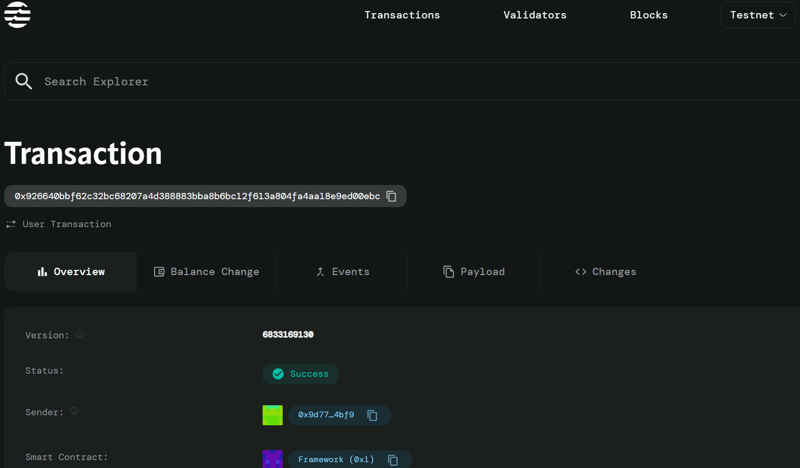

# Identity Registry

## Project Description

The Identity Registry is a decentralized identity verification system built on the Aptos blockchain. This smart contract enables users to register their digital identities on-chain and provides a framework for verification by authorized entities. The system maintains user privacy while establishing trust through blockchain-based identity verification.

## Project Vision

Our vision is to create a secure, transparent, and user-controlled identity verification ecosystem that eliminates the need for centralized identity providers. By leveraging blockchain technology, we aim to give individuals complete ownership and control over their digital identities while enabling seamless verification processes across various platforms and services.

The Identity Registry serves as a foundation for building trust in decentralized applications, enabling KYC compliance, and facilitating secure peer-to-peer interactions in the Web3 ecosystem.

## Key Features

### Core Functionality
- *Decentralized Identity Registration*: Users can register their identities directly on the blockchain without intermediaries
- *Multi-level Verification System*: Supports different verification levels (1-5) based on the thoroughness of identity checks
- *Privacy-Focused Design*: Minimal personal data storage with focus on verification status rather than sensitive information
- *Immutable Records*: All identity registrations and verifications are permanently recorded on the blockchain

### Security Features
- *Duplicate Prevention*: Prevents multiple identity registrations for the same address
- *Verification Tracking*: Maintains detailed verification history and levels
- *Access Control*: Only authorized verifiers can update verification status

### User Benefits
- *Self-Sovereign Identity*: Complete control over personal identity data
- *Interoperability*: Can be integrated with various DApps and services
- *Transparency*: All verification actions are publicly auditable
- *Cost-Effective*: Eliminates fees associated with traditional identity verification services

## Future Scope

### Short-term Enhancements (3-6 months)
- *Enhanced Verification Methods*: Integration with external KYC providers and document verification systems
- *Reputation System*: Implementation of trust scores based on transaction history and community feedback
- *Identity Recovery*: Secure mechanisms for account recovery and identity restoration

### Medium-term Goals (6-12 months)
- *Cross-Chain Compatibility*: Expand identity verification to other blockchain networks
- *Advanced Privacy Features*: Implementation of zero-knowledge proofs for enhanced privacy
- *Mobile SDK*: Development of mobile libraries for easy integration with mobile applications
- *Governance Framework*: Decentralized governance for verification standards and policies

### Long-term Vision (1-2 years)
- *AI-Powered Verification*: Machine learning algorithms for automated identity verification
- *Integration Ecosystem*: Partnerships with major DeFi protocols, NFT marketplaces, and Web3 platforms
- *Global Compliance*: Support for international identity standards and regulatory requirements
- *Advanced Analytics*: Comprehensive identity analytics while maintaining user privacy

### Potential Use Cases
- *DeFi Platforms*: KYC compliance for lending and trading platforms
- *NFT Marketplaces*: Creator verification and authenticity assurance
- *Social Networks*: Prevention of fake accounts and bot activities
- *E-commerce*: Trusted seller/buyer verification systems
- *Gaming*: Anti-cheat systems and tournament verification
- *Education*: Credential verification and academic achievement tracking

## Contract Details

0x926640bbf62c32bc68207a4d388883bba8b6bc12f613a804fa4aa18e9ed00ebc

